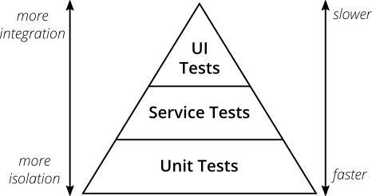
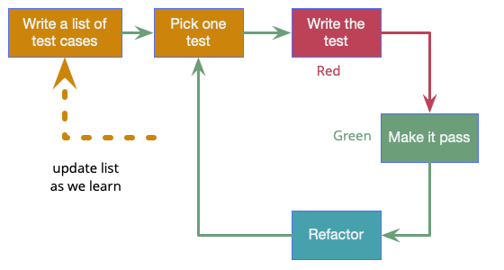

# TDD øvelse
Først beskrives brugerkrav inkl. acceptkriterier til funktionen registrér bruger. 

Efterfølgende hvad du/vi helt konkret skal gøre mht TDD og unit tests.

### Feature: Registrér bruger

**Beskrivelse**

Som besøgende bruger vil jeg kunne oprette en konto med brugernavn og password, så jeg senere kan logge ind og bruge messageboard-systemet.

Implementeringen skal understøtte validering af input og give passende fejlbeskeder til brugeren, hvis input er ugyldigt.

---

### Acceptance Criteria

**AC1 — Brugernavn skal udfyldes**

Givet at brugeren indsender registreringsformularen  
Når brugernavn er tomt eller kun består af whitespace  
Så skal registreringen afvises  
Og fejlbeskeden *"Brugernavn skal udfyldes"* vises.

---

**AC2 — Password skal udfyldes**

Givet at brugeren indsender registreringsformularen  
Når password er tomt eller kun består af whitespace  
Så skal registreringen afvises  
Og fejlbeskeden *"Password skal udfyldes"* vises.

---

**AC3 — Minimumslængde på brugernavn**

Givet at brugeren indsender registreringsformularen  
Når brugernavn er kortere end 3 tegn  
Så skal registreringen afvises  
Og fejlbeskeden *"Brugernavn skal være mindst 3 tegn"* vises.

---

**AC4 — Minimumslængde på password**

Givet at brugeren indsender registreringsformularen  
Når password er kortere end 8 tegn  
Så skal registreringen afvises  
Og fejlbeskeden *"Password skal være mindst 8 tegn"* vises.

---

**AC5 — Password skal indeholde mindst ét tal**

Givet at brugeren indsender registreringsformularen  
Når password ikke indeholder et tal  
Så skal registreringen afvises  
Og fejlbeskeden *"Password skal indeholde mindst ét tal"* vises.

---

**AC6 — Password skal indeholde mindst ét specialtegn**

Givet at brugeren indsender registreringsformularen  
Når password ikke indeholder et specialtegn  
Så skal registreringen afvises  
Og fejlbeskeden *"Password skal indeholde mindst ét specialtegn"* vises.

---

**AC7 — Gyldigt input accepteres**

Givet at brugeren indsender registreringsformularen  
Når brugernavn og password opfylder alle valideringsregler  
Så returnerer valideringen ingen fejl.

---

**AC8 — Bruger oprettes ved gyldigt input**

Givet at brugeren indsender gyldigt brugernavn og password  
Når registreringen gennemføres  
Så oprettes brugeren i databasen  
Og brugeren viderestilles til forsiden eller login-siden.

---

**AC9 — Brugernavn skal være unikt**

Givet at brugeren indsender et brugernavn, som allerede findes i databasen  
Når registreringen gennemføres  
Så skal registreringen afvises  
Og fejlbeskeden *"Brugernavnet findes allerede"* vises.

---

**AC10 — Ingen oprettelse ved valideringsfejl**

Givet at formularen indeholder valideringsfejl  
Når registreringen behandles  
Så må brugeren ikke oprettes i databasen  
Og registreringssiden vises igen med fejlbeskeder.

---

### Tekniske noter

Designet af en web app bør adskille ansvar mellem controller opgaver (at tale med "web") og andre opgaver (f.eks. at tale med databasen). Altså overholde Single Responsibility princippet.

Controllerens typiske opgave er at:
- læse formParam
- sætte ctx.attribute
- vælge render eller redirect

En controller bør *ikke* indeholde:
- SQL
- større forretningslogik (f.eks. lønberegning)
- måske heller ikke passwordregler

---
### I vores konkrete eksempel ("Registrér bruger")
Vi kan unit teste validering:
- Validere input 
- Returnere fejlbesked

Men ikke:
- routes og rendering
- hente form-data fra Context
- kalde mapper, hvis input er gyldigt

Vi kan nemlig ikke sådan bare unit teste web-framework-logik, f.eks Javalin's `Context`. 
Idéen er at vi laver såkaldte rene unit tests. Dvs. som ikke kontrollerer om brugeren rent faktisk oprettes i databasen eller viderestilles til den korrekt side i browseren (den type tests kaldes hhv. service-/integrationstests og UI tests). 

Unit tests ligger derfor i bunden af hvad der kaldes testpyramiden, der illustrerer en hensigtsmæssig tilgang til testautomatisering. Vi vil helst have flest unit tests i vores projekt, fordi de er mest simple at skrive og at afvikle. 

--- 
### Vores Test Strategy (TDD)

Vores strategi bliver at skrive unit tests til validering af kravene til brugernavn og password, 
*før* vi implementerer løsningen.
    
Vi kommer i bedste TDD stil til at arbejde trinvist (iterativt) med test-kode-refaktor 

Eksempler på tests:

* shouldRejectBlankUsername
* shouldRejectBlankPassword
* shouldRejectTooShortUsername
* shouldRejectTooShortPassword
* shouldRejectPasswordWithoutDigit
* shouldRejectPasswordWithoutSpecialCharacter
* shouldAcceptValidUsernameAndPassword

Disse tests driver implementeringen af valideringskontrollen beskrivet i vores acceptkriterier.

---
#### Iteration 1
- Brugernavn skal udfyldes
- Password skal udfyldes

#### Iteration 2
- Brugernavn minimum 3 tegn
- Password minimum 8 tegn

#### Iteration 3
- Password skal indeholde tal

#### Iteration 4
- Password skal indeholde specialtegn

#### Iteration 5
- Håndtering af dublet brugernavn

OBS! Egner sig ikke til ren unit test, da den involverer databasen.
Database-relaterede regler (unik brugernavn) testes via integrationstest.

---
### Definition of Done

* Alle acceptkriterier er implementeret
* Unit tests for validering er grønne
* Registreringssiden viser fejlbeskeder ved ugyldigt input (ikke vores fokus i dag)
* Gyldig registrering opretter bruger i databasen (ikke vores fokus i dag)
* Brugeren viderestilles korrekt efter succesfuld registrering (ikke vores fokus i dag)
